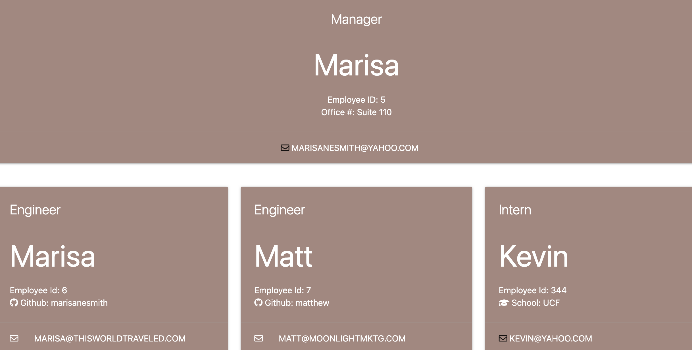

# Team_Roster

 

This application is used for employers to enter the employee roster so that it can generate on a form. 

Table of Contents
* [Usage](#Usage)
* [Tests](#Test)
* [License](#License)
* [Questions](#Questions)

## Usage
Used the Inquirer package, html, css and js

## Tests
* Used Jest to run tests on Employee, Engineer, Intern and Manager

## License

You can find out more about the MIT license on the open source page [here](https://www.opensource.org/licenses/MIT)

## Questions

Please contact me via email if you have any questions about this application.

* GitHub Profile: [github.com/pro](https://github.com/marisanesmith)

* Video Link: [Team Roster Demo](https://drive.google.com/file/d/1lvMw2s2UtXOCoK91Q0aNSBvsFORMloq_/view)

* Email: [pro@yahoo.com](marisanesmith@yahoo.com)